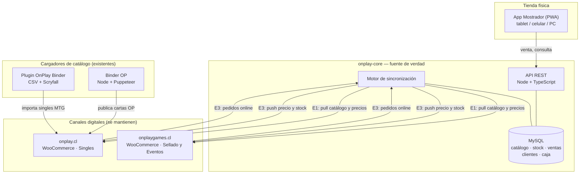
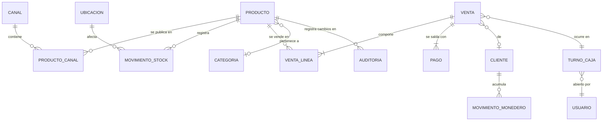
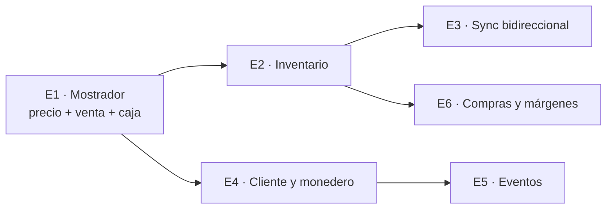

# SDD — Sistema POS/ERP OnPlay
## Documento de Diseño de Software — General

| | |
|---|---|
| **Proyecto** | Sistema POS/ERP para Comercializadora y Distribuidora BM |
| **Nombre en código** | `onplay-core` |
| **Versión** | 1.2 |
| **Revisión 1.2** | Corrige la regla S2 (la API `wc/v3` no admite escritura incremental de stock) y §8.2 tras la especificación de la Etapa 3 |
| **Fecha** | 22 de agosto de 2026 |
| **Revisión 1.1/1.2** | Incorpora las reglas S1–S4 derivadas de la revisión de código del Binder OP (`docs/03-revision-codigo-binder-op.md`) |
| **Autor** | Jose Manuel Osborquez (con asistencia de Claude) |
| **Documento previo obligatorio** | `docs/00-linea-base-sistema-actual.md` |
| **Documentos hijos** | `docs/02-SDD-etapa1-mostrador.md` (spec ejecutable de Etapa 1) |

---

## 1. Contexto y problema

Comercializadora y Distribuidora BM opera tres frentes de venta que hoy no comparten datos:

| Frente | Qué vende | Dónde vive hoy |
|---|---|---|
| **onplay.cl** | Singles de cartas (Magic, One Piece) | WooCommerce, 2.132 productos |
| **onplaygames.cl** | Sellado, accesorios, juegos de mesa, eventos | WooCommerce, 260 productos + 138 eventos |
| **Tienda física** (Merced 832, Local 53-54) | Todo lo anterior + snacks, bebidas y confitería | **En ninguna parte** |

**El síntoma que define el proyecto:** cuando un cliente pregunta el precio de un producto que no está publicado, quien atiende no lo sabe y debe llamar por teléfono a otra persona. La venta se detiene.

**La causa raíz** no es la falta de un sistema, sino la falta de **una fuente de verdad**. Existen dos catálogos independientes, cero registro de la venta presencial, y una categoría completa de productos (snacks) que no está en ningún sistema.

**El patrón a romper:** se han intentado al menos cuatro implementaciones parciales que quedaron a medias, todas visibles hoy en producción como plugins instalados y desactivados:

- FooSales POS (onplay.cl) — desactivado
- WCPOS (onplaygames.cl) — desactivado
- WooCommerce Customer Wallet (onplay.cl) — desactivado
- OnplayWallet, desarrollo propio (onplaygames.cl) — desactivado

Cada intento abarcó demasiado alcance de una vez. Este SDD está estructurado para que **cada etapa entre en producción y aporte valor por sí sola**, aunque las siguientes nunca se construyan.

---

## 2. Objetivos

### 2.1 Objetivo del sistema

Ser la **fuente de verdad única** de productos, precios, inventario, clientes y ventas de BM, y alimentar desde ahí los canales digitales que ya existen.

### 2.2 Objetivos por prioridad

| # | Objetivo | Etapa |
|---|---|---|
| O1 | Que cualquier persona en el mostrador conozca el precio de cualquier producto en menos de 5 segundos, sin llamar a nadie | E1 |
| O2 | Que toda venta presencial quede registrada, con su medio de pago y su caja cuadrada al cierre del día | E1 |
| O3 | Que exista un inventario real y auditable de lo que hay en la tienda | E2 |
| O4 | Que precio y stock se publiquen solos hacia los dos sitios web | E3 |
| O5 | Que un cliente sea el mismo cliente compre donde compre, con saldo y crédito propios | E4 |
| O6 | Que los eventos tengan cupo, cobro e inscripción en un solo lugar | E5 |
| O7 | Que se conozca el costo y el margen real de lo que se vende | E6 |

### 2.3 No-objetivos (explícitos)

Lo siguiente **queda fuera del sistema**, ahora y en el diseño:

- **No reemplaza el checkout de los sitios web.** Transbank, Mercado Pago y el carrito de WooCommerce siguen operando tal cual.
- **No fusiona onplay.cl con onplaygames.cl.** Los dos canales se mantienen separados por decisión comercial. El sistema es multicanal desde el día uno.
- **No es contabilidad ni facturación electrónica.** El sistema registra ventas y medios de pago; la emisión de boletas/facturas al SII queda fuera del alcance de este SDD (se contempla como punto de integración futuro, ver §12).
- **No reemplaza el Binder OP ni el plugin OnPlay Binder.** Ambos siguen siendo los cargadores de catálogo de cartas; el sistema los consume.
- **No implementa grading, condiciones múltiples ni variantes foil/no-foil de cartas en E1–E3.** Se mantiene la convención vigente (`NM`/`EN` para One Piece, condición en el SKU para Magic).

---

## 3. Principios de diseño

Estos principios existen para impedir que el proyecto se complejice hasta morir, como ocurrió antes. Son vinculantes.

**P1 — Cada etapa se puede usar sola.** Una etapa que solo tiene sentido cuando exista la siguiente está mal cortada. Si la Etapa 2 nunca se construye, la Etapa 1 debe seguir siendo útil.

**P2 — Espejo antes que control.** El sistema primero *lee* de WooCommerce y muestra. Solo cuando esa lectura es confiable, empieza a *escribir*. Nunca al revés.

**P3 — No renumerar lo que ya funciona.** Ningún SKU ya publicado se reescribe. Los productos que hoy no tienen SKU (buena parte del sellado, accesorios y snacks) reciben un SKU maestro interno que **no se publica** en E1. El sistema mantiene una tabla de correspondencia, no una migración de identificadores.

**P4 — El stock es opcional por producto.** Un producto puede existir con precio y sin control de stock (`controla_stock = false`). Esto permite vender desde el día uno sin haber hecho un inventario.

**P5 — Todo movimiento es un asiento, nunca un update.** Stock, caja y saldo de cliente se modelan como libros de movimientos append-only. El saldo es siempre una suma, nunca un campo que se sobrescribe.

**P6 — Una sola base de datos, un solo backend.** Sin microservicios, sin colas, sin event bus. Un proceso Node, una base MySQL. Se añade infraestructura solo cuando un problema medido lo exija.

**P7 — Español en el dominio, inglés en la infraestructura.** `producto`, `venta`, `movimiento_stock`, `turno_caja`; `Repository`, `Service`, `Controller`. Sigue la convención ya establecida en `onplay-manager` y el Binder OP.

**P8 — Offline-tolerante en mostrador.** La caída de internet no puede detener la venta presencial. La app de mostrador funciona con el catálogo cacheado y encola las ventas.

**P9 — Nada se borra.** Anulaciones, devoluciones y correcciones son registros nuevos que compensan, no eliminaciones.

---

## 4. Arquitectura general



### 4.1 Componentes

| Componente | Responsabilidad | Etapa en que aparece |
|---|---|---|
| **`onplay-core` API** | Única puerta de entrada a los datos. Catálogo, precios, ventas, caja, stock, clientes | E1 |
| **`onplay-core` DB** | MySQL. Fuente de verdad | E1 |
| **Motor de sincronización** | Pull de catálogo desde ambos Woo (E1); push de precio y stock (E3); ingesta de pedidos (E3) | E1 (solo lectura) |
| **App Mostrador (PWA)** | Consulta de precios y venta presencial. Funciona en tablet, celular o PC del local | E1 |
| **Backoffice web** | Alta de productos, precios, ajustes de stock, reportes | E1 (mínimo) → crece por etapa |
| **Binder OP / OnPlay Binder** | Se mantienen intactos como cargadores de catálogo de cartas | — (existentes) |

### 4.2 Por qué "maestro por encima" y no reemplazo

Los dos WooCommerce facturan hoy, tienen SEO, medios de pago certificados y clientes con cuenta. Apagarlos es un proyecto de migración de seis meses con riesgo de pérdida de ventas. Ponerse encima permite:

- Empezar a resolver el mostrador **sin tocar los sitios**.
- Probar la sincronización en modo lectura antes de que un error pueda romper un catálogo en producción.
- Revertir en cualquier momento: si el sistema se cae, los sitios siguen vendiendo.

---

## 5. Stack tecnológico

| Capa | Decisión | Justificación |
|---|---|---|
| **Backend** | Node.js 20 + TypeScript + Fastify | El equipo ya opera Node (Binder OP). TypeScript reduce el tipo de error que hizo fracasar iteraciones anteriores. Fastify por rendimiento y validación de esquemas nativa. |
| **Base de datos** | MySQL 8 / MariaDB | Ya está provisto y operado en Hostinger. No introduce un motor nuevo. Transaccional, suficiente para el volumen (decenas de miles de productos, miles de ventas/mes). |
| **ORM** | Prisma | Migraciones versionadas y tipadas. Evita el drift de esquema. |
| **Frontend** | React 19 + Vite + Tailwind 3.4 | Idéntico al stack del Binder OP: el equipo ya lo conoce y hay componentes reutilizables. |
| **App Mostrador** | PWA (mismo bundle React) + IndexedDB para caché offline | Un solo código para tablet, celular y PC. Sin app store. Cumple P8. |
| **Autenticación** | JWT de sesión corta + refresh token; roles por usuario | Simple, sin dependencias externas. |
| **Integración WooCommerce** | WooCommerce REST API v3 (`ck_`/`cs_`) | Estándar, ya usada por el Binder OP. El MCP existente queda como canal secundario de diagnóstico y operaciones puntuales. |
| **Despliegue** | VPS Hostinger (Node + MySQL), detrás de Nginx, con PM2 | Requiere VPS, no hosting compartido. **Verificar el plan contratado antes de E1** (ver Riesgo R1). |

### 5.1 Estructura del repositorio

```
onplay-core/
├── apps/
│   ├── api/                  # Fastify + Prisma (backend)
│   └── web/                  # React (Mostrador + Backoffice, un solo bundle)
├── packages/
│   ├── dominio/              # Tipos y reglas de negocio compartidas (español)
│   └── woo-client/           # Cliente tipado de WooCommerce REST
├── prisma/
│   ├── schema.prisma
│   └── migrations/
├── docs/
│   ├── 00-linea-base-sistema-actual.md
│   ├── 01-SDD-general.md      ← este documento
│   └── 02-SDD-etapa1-mostrador.md
└── CLAUDE.md                 # Guía operativa para Claude Code
```

Monorepo con workspaces de npm. Sin herramientas de build adicionales (sin Turborepo, sin Nx) hasta que el tiempo de build lo justifique — principio P6.

### 5.2 Qué se hereda del Binder OP y qué no

**No es la misma arquitectura.** El Binder OP es una herramienta personal de un solo usuario que corre en un PC; `onplay-core` maneja dinero, stock y varias personas a la vez. Las decisiones que son correctas en el primer caso serían defectos en el segundo.

| Dimensión | Binder OP (herramienta personal) | `onplay-core` (sistema de negocio) |
|---|---|---|
| **Lenguaje** | JavaScript | **TypeScript estricto** — el tipo de error que hundió iteraciones anteriores es precisamente el que el compilador atrapa |
| **Persistencia** | Un archivo `db.json` reescrito entero | **MySQL con transacciones.** Una venta con sus líneas, sus pagos y su folio se confirma entera o no ocurre |
| **Concurrencia** | Un solo usuario, sin bloqueos | Varias cajas a la vez: folios correlativos con `SELECT … FOR UPDATE`, libros de movimientos append-only |
| **Autenticación** | Una clave compartida en el bundle del navegador | **Sesión JWT con roles**, verificada en el servidor en cada endpoint. Ningún secreto llega al navegador (regla S3) |
| **Estado** | Se sobrescribe | **Nada se borra** (P9): stock, caja y saldo son sumas sobre un libro de asientos |
| **Pruebas** | Ninguna | Las reglas de negocio llevan test desde el primer commit |
| **Escritura a canales** | Directa, sin simulación | `dryRun` obligatorio y por defecto (regla S1); stock diferencial (S2) |

**Lo que sí se hereda, y se hereda tal cual:**

- **El runtime y el lenguaje base**: Node en el servidor, React + Vite + Tailwind en el cliente. El equipo ya los opera; cambiar de stack solo añadiría riesgo.
- **`categoryService`**: caché, deduplicación de promesas y manejo de `term_exists` en carrera. Es la pieza más madura del Binder y el motor de sincronización de E3 parte de ella.
- **Las convenciones ya validadas**: lotes de 50, un error por ítem nunca aborta el lote, `describeError` (que sabe interpretar una respuesta HTML de un WAF de LiteSpeed, que es lo que devuelve Hostinger cuando algo va mal), y los nombres de negocio en español.
- **La identidad de producto por identificador estable**, no por un número que se repite. En el Binder es el nombre de archivo; en `onplay-core` es `producto_canal` (§7.2). Es la misma idea.

**Y el Binder OP sigue existiendo.** No se absorbe ni se reescribe: continúa siendo el cargador de cartas de One Piece hacia onplay.cl, igual que el plugin OnPlay Binder lo es para Magic. `onplay-core` los consume vía el pull de catálogo de E1.

---

## 6. Modelo de datos

### 6.1 Diagrama de entidades del núcleo



### 6.2 Entidades del núcleo

> **Convenciones de este apartado.** Los nombres se escriben aquí en `snake_case` por legibilidad; el esquema real (`02` §4.1) usa `camelCase` en Prisma y en las columnas de MySQL, sin `@map`. La correspondencia es directa: `precio_venta` ↔ `precioVenta`.
>
> **Identificadores:** todas las entidades usan `cuid` generado por Prisma, no ULID. La única excepción es `idempotencyKey` de `venta`, que es un ULID generado por el **cliente** (`02` §5.4).
>
> **Entidades por etapa:** `producto`, `producto_canal`, `categoria`, `canal`, `venta`, `venta_linea`, `pago`, `turno_caja`, `usuario`, `auditoria`, `correlativo` son de **E1**. `ubicacion` y `movimiento_stock` llegan en **E2**. `cliente`, `cliente_canal` y `movimiento_monedero` en **E4**. Ninguna se crea antes de la etapa que la necesita.

#### `producto` — la entidad central

| Campo | Tipo | Notas |
|---|---|---|
| `id` | cuid | Inmutable. Nunca se reutiliza ni se cambia |
| `sku` | string único | SKU maestro. Ver §7 |
| `nombre` | string | |
| `tipo` | enum | `single` · `sellado` · `accesorio` · `snack` · `juego_mesa` · `juguete` · `evento` · `indeterminado` |
| `juego` | string nullable | **Campo libre, no enum.** Valores conocidos: `magic`, `one_piece`, `pokemon`, `riftbound`, `star_wars`, `flesh_and_blood`. El catálogo real incorpora juegos nuevos varias veces al año; un enum obligaría a una migración cada vez |
| `categoria_id` | FK nullable | Categoría interna, unificada. No es la de WooCommerce. Nullable: el importador puede dejar productos en "Sin clasificar" |
| `precio_venta` | int (CLP) | Sin decimales. CLP no los usa |
| `costo_referencia` | int nullable | **Se agrega por migración en E6.** No existe en el esquema de E1 |
| `controla_stock` | bool | **Default `false`**. Principio P4 |
| `activo` | bool | |
| `posible_duplicado` | bool | Marcado por el importador cuando existe un candidato a fusión en otro canal (§7.3) |
| `imagen_url` | string nullable | |
| `atributos` | JSON | Metadatos específicos del tipo: para cartas `{card_number, set_code, rarity, color, card_type, is_alt_art, condicion, idioma}`; para snacks `{formato, sabor}` |
| `creado_en` / `actualizado_en` | datetime | |

> Los atributos específicos de carta viven en `atributos` (JSON), no en columnas. Un snack y un single de Magic son el mismo tipo de fila, con contenido distinto en el JSON. Esto evita 40 columnas nulas y refleja lo que ya hacen ambos sitios con `meta_data`.

#### `producto_canal` — la tabla que evita renumerar (Principio P3)

| Campo | Tipo | Notas |
|---|---|---|
| `id` | ULID | |
| `producto_id` | FK → `producto` | |
| `canal_id` | FK → `canal` | `onplay_cl` · `onplaygames_cl` · `tienda_fisica` |
| `externo_id` | int nullable | ID del post en WooCommerce |
| `externo_sku` | string nullable | SKU tal cual existe en ese canal (`MOM-75-NM-EN`, `OP-EB04-001-P1`) |
| `publicado` | bool | |
| `precio_canal` | int nullable | Si es null, hereda `producto.precio_venta`. Permite precio distinto online vs mostrador |
| `sincronizado_en` | datetime nullable | |
| `hash_ultimo_sync` | string nullable | Para detectar cambios sin comparar campo por campo |

**Restricción única:** (`canal_id`, `externo_id`) y (`canal_id`, `externo_sku`).

Esta tabla es la pieza clave de toda la arquitectura: permite que el mismo producto físico exista con SKU `MOM-75-NM-EN` en onplay.cl, sin SKU en onplaygames.cl, y con SKU maestro `MTG-MOM-075-NM-EN` internamente, sin tocar nada de lo publicado.

#### `movimiento_stock` — libro de inventario (Principio P5)

| Campo | Tipo | Notas |
|---|---|---|
| `id` | ULID | |
| `producto_id` | FK | |
| `ubicacion_id` | FK → `ubicacion` | `mostrador` · `carpetas` · `vitrina` · `bodega` |
| `cantidad` | int | **Con signo.** Positivo entra, negativo sale |
| `motivo` | enum | `recuento_inicial` · `compra` · `venta` · `venta_online` · `ajuste` · `merma` · `devolucion` · `traslado` |
| `referencia_tipo` / `referencia_id` | string / ULID | Apunta a la venta, OC o ajuste que lo originó |
| `usuario_id` | FK | Quién lo hizo |
| `creado_en` | datetime | |

El stock actual de un producto es `SUM(cantidad)` sobre este libro. Se materializa en una vista o tabla de resumen `stock_actual` (`producto_id`, `ubicacion_id`, `cantidad`) actualizada transaccionalmente, para no recalcular en cada consulta.

#### `venta`, `venta_linea`, `pago`

`venta`: `id`, `folio` (correlativo legible: `V-2026-00001`), `canal_id`, `turno_caja_id`, `cliente_id` nullable, `subtotal`, `descuento`, `total`, `estado` (`completada` · `anulada`), `usuario_id`, `creado_en`.

`venta_linea`: `id`, `venta_id`, `producto_id` nullable, `descripcion` (congelada al momento de la venta), `cantidad`, `precio_unitario`, `descuento_linea`, `total_linea`.

> `producto_id` es nullable a propósito: permite vender un ítem suelto no catalogado ("varios $2.000") sin bloquear la venta. Esos casos quedan reportados para dar de alta después.

`pago`: `id`, `venta_id`, `medio` (`efectivo` · `debito` · `credito` · `transferencia` · `mercadopago` · `otro`; `monedero` se agrega por migración en E4), `monto` (el importe **imputado** a la venta, no el recibido), `monto_recibido` nullable (solo efectivo, para calcular vuelto), `referencia` nullable (número de operación o voucher; **nunca** dígitos de tarjeta). **Varios pagos por venta** (pago mixto: parte efectivo, parte tarjeta).

#### `turno_caja` — trazabilidad de caja (Objetivo O2)

`id`, `usuario_id`, `estado`, `abierto_en`, `monto_apertura`, `cerrado_en` nullable, `monto_declarado` nullable, `monto_esperado` nullable, `diferencia` nullable, `notas`.

Ninguna venta se registra sin un turno abierto. La fórmula del arqueo es:

```
monto_esperado = monto_apertura
               + SUM(pago.monto) WHERE pago.medio = 'efectivo'
                                   AND venta.turno_caja_id = <turno>
                                   AND venta.estado = 'completada'
diferencia     = monto_declarado - monto_esperado
```

**Omitir `monto_apertura` haría que la caja nunca cuadre.** Las ventas anuladas quedan fuera del esperado por el filtro de estado.

Una venta de un turno **ya cerrado no se puede anular**: el arqueo quedaría inconsistente. Esos casos se resuelven con una devolución (E2).

#### `cliente` y `movimiento_monedero` (E4)

`cliente`: `id`, `nombre`, `email` nullable, `telefono` nullable, `rut` nullable, `notas`, `creado_en`. Más `cliente_canal` (`cliente_id`, `canal_id`, `externo_user_id`) siguiendo el mismo patrón que `producto_canal`, para vincular las cuentas de usuario de ambos WordPress a un único cliente.

`movimiento_monedero`: `id`, `cliente_id`, `monto` (con signo), `motivo` (`carga` · `consumo` · `devolucion` · `ajuste` · `premio_evento`), `referencia_tipo`/`referencia_id`, `usuario_id`, `creado_en`. Saldo = `SUM(monto)`. Principio P5.

#### `auditoria` — rastro de acciones humanas (E1)

`id`, `usuario_id`, `entidad` (`producto` · `venta` · `turno_caja` · `usuario`), `entidad_id`, `accion` (`crear` · `editar` · `anular` · `cambiar_precio`), `valor_anterior` JSON nullable, `valor_nuevo` JSON nullable, `creado_en`.

Es una tabla **distinta** de `sync_log`. `sync_log` registra lo que hace la máquina contra WooCommerce; `auditoria` registra lo que hace una persona. Mezclarlas haría imposible saber si un canal tiene errores pendientes de sincronización.

#### `correlativo` — folios sin colisión (E1)

`clave` (PK, ej. `venta`), `anio`, `ultimo`.

El folio de venta (`V-2026-00001`) se asigna con `SELECT ... FOR UPDATE` sobre esta tabla, **dentro de la misma transacción de la venta**. Consecuencia a tener presente: una venta registrada offline recibe su folio al llegar al servidor, no al momento de cobrarse, por lo que el folio refleja el orden de llegada y no siempre el orden cronológico.

#### `usuario` y roles

`usuario`: `id`, `nombre`, `email`, `password_hash`, `rol`, `activo`.

| Rol | Puede |
|---|---|
| `vendedor` | Consultar precios, vender, abrir y cerrar su turno, ver **las ventas de su propio turno abierto** |
| `encargado` | Todo lo de vendedor + ver todas las ventas y reportes, ajustar stock, anular ventas, cambiar precios |
| `admin` | Todo + alta de usuarios, configuración de canales, ejecutar sincronizaciones |

---

## 7. Identidad de producto y SKU maestro

Este es el punto donde los intentos anteriores se quebraron. Hoy conviven dos convenciones incompatibles:

| Origen | Patrón | Ejemplo |
|---|---|---|
| Plugin OnPlay Binder (Magic) | `{SET}-{Nº}-{CONDICIÓN}-{IDIOMA}` | `MOM-75-NM-EN` |
| Binder OP (One Piece) | `OP-{FILEBASE}` | `OP-EB04-001-P1` |
| Snacks, accesorios, sellado | **No existe** | — |

### 7.1 Regla

El sistema define un **SKU maestro** con la forma:

```
{PREFIJO_TIPO}-{IDENTIFICADOR_NATURAL}
```

| Tipo | Prefijo | Identificador natural | Ejemplo |
|---|---|---|---|
| Single Magic | `MTG` | `{SET}-{Nº 3 díg}-{COND}-{IDIOMA}` | `MTG-MOM-075-NM-EN` |
| Single One Piece | `OPT` | `{FILEBASE normalizado}` | `OPT-EB04-001-P1` |
| Sellado | `SLD` | correlativo | `SLD-000142` |
| Accesorio | `ACC` | correlativo | `ACC-000073` |
| Snack | `SNK` | correlativo | `SNK-000018` |
| Juego de mesa | `JDM` | correlativo | `JDM-000068` |
| Evento | `EVT` | `{AÑO}-{correlativo}` | `EVT-2026-0093` |

### 7.2 Y lo que ya está publicado, ¿se renumera?

**No.** Principio P3. El SKU que hoy tiene un producto en WooCommerce se guarda **tal cual** en `producto_canal.externo_sku`. El SKU maestro es interno y convive con él. La correspondencia se resuelve por tabla, no por convención de nombres.

Esto significa que la sincronización de E3 nunca reescribe un SKU existente. Solo los productos **nuevos** creados desde el sistema nacen con el SKU maestro en ambos lados.

### 7.3 Deduplicación en la importación inicial

Al importar los 2.392 productos existentes, el mismo producto físico puede aparecer en ambos sitios (un sobre publicado en los dos). El importador propone candidatos a fusión por coincidencia de `nombre` normalizado + `precio` dentro de ±10%, y **los deja pendientes de confirmación humana**. Nunca fusiona solo. Ver `02-SDD-etapa1-mostrador.md` §6.6 (algoritmo) y §8 (pantalla de confirmación).

---

## 8. Motor de sincronización

### 8.1 Etapas de la sincronización (Principio P2)

| Etapa | Dirección | Qué mueve | Riesgo |
|---|---|---|---|
| **E1** | Woo → core | Catálogo, precios, imágenes, categorías | Nulo (solo lectura) |
| **E3a** | core → Woo | Precio | Bajo (reversible) |
| **E3b** | core → Woo | Stock | Medio |
| **E3c** | Woo → core | Pedidos online → descuento de stock | Medio |

No se avanza a la siguiente subetapa hasta que la anterior corra siete días sin discrepancias.

**Restricción vinculante de E3b — el push de stock exige verificación previa.**

El motor **no puede** enviar a WooCommerce un `stock_quantity` calculado desde el maestro y punto. Antes de escribir tiene que leer el stock actual del canal y compararlo con **el último valor que él mismo publicó** (`producto_canal.stockPublicado`). Solo escribe si coinciden. Si el stock del canal cambió por una causa que el maestro no conoce —una venta online que aún no se ingirió, un ajuste manual en wp-admin— la operación **se detiene y se reporta en el panel de discrepancias**; no se pisa.

> Una versión anterior de esta restricción decía "diferencial, nunca absoluto" y apuntaba a `hash_ultimo_sync`. Se corrigió por dos razones: la API `wc/v3` **no admite escritura incremental de stock** —solo acepta `stock_quantity` absoluto—, y `hash_ultimo_sync` cumple otra función (detectar cambios en el pull de catálogo de E1). El mecanismo real está en `06` §4.1.

Esto no es teoría: es exactamente el defecto que la revisión del Binder OP encontró en producción (`03-revision-codigo-binder-op.md`, P0 #2). El `PUT` mandaba el valor absoluto del panel, así que re-sincronizar una carta para corregirle el precio reponía stock ya vendido. Falla en silencio: funciona, y produce un dato falso que nadie mira hasta que un cliente paga por algo que no existe.

### 8.2 Diseño del sync

- **Un job por canal y por tipo de operación**, ejecutado por `node-cron` dentro del mismo proceso (P6) — un job por tipo es lo que permite encender y apagar cada operación por separado. Frecuencia inicial: cada 30 minutos para el catálogo en E1; en E3, una corrida combinada cada 15 minutos más publicación a demanda al guardar un precio. **Sin cola en memoria con reintento**: reintentar en caliente contra un sitio que está fallando lo empeora, y una cola es infraestructura que P6 no autoriza.
- **Idempotente y por lotes de 50**, replicando la convención ya validada en el Binder OP.
- **Upsert por `externo_id`**, con `externo_sku` como llave secundaria.
- **Registro de toda operación** en `sync_log` (`canal_id`, `operacion`, `producto_id`, `resultado`, `detalle`, `creado_en`). Un fallo por producto nunca aborta el lote.
- **Modo simulación (`dry_run`) obligatorio** antes del primer push real de cada subetapa: el job escribe en `sync_log` lo que *habría* hecho, sin llamar a WooCommerce.

### 8.3 Reglas heredadas de la revisión del Binder OP

Cuatro reglas que no salieron de la teoría sino de defectos medidos en el código que hoy publica cartas en onplay.cl. Son vinculantes para `onplay-core`.

| # | Regla | Origen |
|---|---|---|
| **S1** | **Simulación obligatoria.** Toda operación que escriba en un canal externo tiene modo `dryRun`, y ese modo es el **valor por defecto** de la interfaz. Publicar es una acción explícita. El `dryRun` no puede tener efectos colaterales: si crear un producto implica crear su categoría, la simulación tampoco crea la categoría | El Binder no tenía simulación: un cero de más en "Precio a todos" quedaba publicado en segundos |
| **S2** | **Push de stock con verificación previa obligatoria** (§8.1): nunca se escribe un valor sin haber comprobado que el canal coincide con el último valor publicado por este sistema. Si no coincide, no se escribe | El `PUT` absoluto reponía stock vendido |
| **S3** | **Ningún secreto en el navegador.** La aplicación web nunca recibe una credencial que sirva para escribir en un canal. La autenticación es por sesión (JWT + cookie), y las credenciales de WooCommerce viven solo en el servidor | En el Binder, Vite incrusta `VITE_API_KEY` en el bundle en tiempo de compilación: publicar `dist/` regala la llave de la tienda |
| **S4** | **Escritura de datos siempre transaccional o atómica.** En `onplay-core` esto lo da MySQL; la regla existe para que nadie "resuelva rápido" un caso guardando un JSON en disco | `fs.outputJson` reescribiendo `db.json` mientras otro proceso lo leía: **144 de 150** lecturas concurrentes rotas, medido |

Y una quinta que es de método más que de diseño: **las reglas de negocio llevan test desde el primer commit.** El Binder llegó a producción sin ninguno, y los cuatro defectos anteriores habrían salido en la primera ejecución de una prueba. En `onplay-core` los cálculos de total, arqueo, SKU y validación de pagos son la superficie mínima cubierta (`02` §12).

### 8.4 Resolución de conflictos

Cuando un precio cambia en ambos lados entre dos sincronizaciones:

- En **E1** (solo lectura): gana WooCommerce, siempre.
- Desde **E3**: gana `onplay-core`. WooCommerce pasa a ser un destino, y editar un precio desde el admin de WordPress queda desaconsejado por procedimiento (se documenta, no se bloquea técnicamente).

---

## 9. Roadmap por etapas

Cada etapa es un entregable independiente, con su propio criterio de "listo" y su propia puesta en producción.

### Etapa 1 — Consulta de precios y venta en mostrador
**Resuelve:** O1, O2 · **Detalle completo en `02-SDD-etapa1-mostrador.md`**

- Catálogo espejo: importación de los 2.392 productos desde ambos WooCommerce (solo lectura).
- Alta manual de snacks, bebidas y confitería — la categoría que hoy no existe en ningún lado.
- Buscador de mostrador: por nombre, SKU, número de carta o código de barras.
- Venta presencial con pago mixto.
- Turno de caja con apertura, cierre y arqueo.
- Backoffice mínimo: alta y edición de producto, listado de ventas del día.

**Listo cuando:** durante una semana completa, toda venta presencial se registra en el sistema y la caja cuadra al cierre sin intervención manual.

### Etapa 2 — Inventario real
**Resuelve:** O3

- Ubicaciones (`mostrador`, `carpetas`, `vitrina`, `bodega`).
- Recuento inicial guiado, por categoría y por tanda — no se exige inventariar los 2.132 singles publicados, ni las carpetas completas, de una vez.
- Libro de movimientos y stock actual por ubicación.
- Ajustes, mermas y traslados.
- Alertas de quiebre y de stock bajo.
- Activación gradual de `controla_stock` por producto (P4): se empieza por snacks y sellado, las cartas quedan para el final.

**Listo cuando:** el stock de snacks y sellado en el sistema coincide con el conteo físico en dos recuentos consecutivos.

### Etapa 3 — Sincronización bidireccional
**Resuelve:** O4

- E3a: push de precio a ambos canales.
- E3b: push de stock.
- E3c: ingesta de pedidos online y descuento automático de inventario.
- Panel de discrepancias: qué está distinto entre core y cada canal, y por qué.

**Listo cuando:** un cambio de precio hecho en el sistema aparece en los dos sitios en menos de 5 minutos, y una venta online descuenta el stock que ve el mostrador.

### Etapa 4 — Cliente único y monedero
**Resuelve:** O5

- Entidad `cliente` y vinculación con las cuentas de usuario de ambos WordPress vía `cliente_canal`.
- Historial de compra consolidado (presencial + ambos canales).
- Monedero: carga, consumo, devolución, premios de evento.
- Pago con saldo como medio de pago en el mostrador.
- **Reemplaza definitivamente** a WooCommerce Customer Wallet y OnplayWallet, que se desinstalan.

**Listo cuando:** un cliente puede acumular saldo por un premio de torneo y gastarlo en el mostrador y online.

### Etapa 5 — Eventos e inscripciones
**Resuelve:** O6

Hoy un evento está modelado de tres formas simultáneas: como `tribe_events` (138 registros), como producto WooCommerce con el cupo en el stock, y con el plugin Event Tickets activo. El sistema unifica:

- Entidad `evento`: fecha, juego, formato, cupo, precio de inscripción, estado.
- Inscripción vinculada a `cliente` y a una `venta`.
- Check-in en el mostrador el día del evento.
- Publicación del evento hacia The Events Calendar de onplaygames.cl (se mantiene como vitrina).

**Listo cuando:** un torneo se crea una sola vez, se cobra por cualquier canal, y la lista de inscritos es la misma que la del check-in.

### Etapa 6 — Compras, proveedores y márgenes
**Resuelve:** O7

- Proveedores y órdenes de compra.
- Recepción de mercadería que genera movimientos de stock positivos.
- Costo promedio ponderado por producto.
- Reporte de margen por producto, categoría y canal.
- Sugerencia de reposición basada en rotación.

**Listo cuando:** se puede responder "cuánto ganamos con los sobres de Pokémon el mes pasado" sin abrir una planilla.

### 9.1 Secuencia y dependencias



E4 depende solo de E1: el monedero se puede construir antes que el inventario si el negocio lo prioriza. E3 y E6 sí exigen inventario.

---

## 10. Seguridad

- **Credenciales de WooCommerce** (`ck_`/`cs_`) en variables de entorno, nunca en el repositorio. Un par por canal, con permisos de solo lectura hasta E3.
- **Autenticación de la API**: JWT firmado, expiración de 8 horas (un turno). Refresh token de 30 días para la PWA del mostrador, revocable por el admin.
- **Autorización por rol** verificada en el servidor, en cada endpoint. Nunca solo en la interfaz.
- **Auditoría**: toda operación que cambie precio, stock, saldo de cliente o anule una venta registra `usuario_id` y timestamp. Principio P9.
- **Contraseñas**: `argon2id`.
- **Datos personales de clientes**: solo lo necesario (nombre, contacto, RUT si se factura). Sin almacenamiento de datos de tarjeta — el sistema nunca ve un número de tarjeta; el cobro con débito/crédito se hace en el POS de Transbank y en el sistema solo se registra el medio y el monto.
- **Respaldo**: dump diario de MySQL retenido 30 días, más respaldo semanal fuera del servidor.

---

## 11. Operación

| Aspecto | Definición |
|---|---|
| **Entornos** | `local` (desarrollo) y `produccion`. Sin staging hasta E3, donde se vuelve obligatorio antes del primer push a WooCommerce |
| **Migraciones** | Prisma Migrate, versionadas en el repositorio. Ninguna migración destructiva sin respaldo previo verificado |
| **Logs** | A archivo, con rotación. Nivel `info` en producción, `debug` activable por variable de entorno |
| **Monitoreo mínimo** | Endpoint `/salud` que verifica base de datos y conectividad con ambos WooCommerce. Alerta por correo si falla 3 veces seguidas |
| **Despliegue** | `git pull` + `npm ci` + `prisma migrate deploy` + `pm2 reload`. Documentado en `CLAUDE.md`, sin CI/CD hasta que el equipo lo necesite |

---

## 12. Puntos de integración futuros (fuera de alcance)

Se dejan nombrados para que el modelo de datos no los impida, pero **no se construyen**:

- **Boleta y factura electrónica (SII).** La entidad `venta` ya tiene folio, total y desglose de medios de pago; conectar un proveedor de DTE es un trabajo aislado.
- **Precio sugerido de mercado para singles.** Para Magic la fuente **ya está conectada**: la API de Scryfall devuelve un objeto `prices` (`usd`, `usd_foil`, `eur`) y el plugin OnPlay Binder ya la consulta y cachea (`_onplay_scryfall_cached_at`). Lo que falta definir es la conversión a CLP y el margen. Para One Piece no hay fuente equivalente gratuita (habría que recurrir a TCGPlayer o Cardmarket).
- **Fusión de canales.** Si en el futuro se decide unificar onplay.cl y onplaygames.cl, `producto_canal` permite apagar un canal sin tocar el catálogo.

---

## 13. Riesgos

| # | Riesgo | Impacto | Mitigación |
|---|---|---|---|
| **R1** | El plan de Hostinger es hosting compartido y no permite ejecutar Node | **Bloqueante para E1** | Verificar el plan antes de escribir código. Si es compartido: contratar VPS, o replantear el backend en PHP reutilizando el entorno actual. Decisión pendiente, ver §14 |
| **R2** | El Binder OP no está versionado — solo existen sus especificaciones en GitHub | Alto | Subir el código real al repositorio antes de empezar E1. Es una tarea de una hora |
| **R3** | La importación inicial duplica productos que existen en ambos sitios | Medio | El importador marca `posible_duplicado` y el backoffice lo expone como filtro desde el primer día; la fusión asistida (F11 de E1, prioridad P1) es propuesta pero nunca automática (§7.3) |
| **R4** | Se repite el patrón histórico: se amplía el alcance de E1 y no llega a producción | **Crítico** | Los principios P1–P9 son vinculantes. Toda funcionalidad no listada en `02-SDD-etapa1-mostrador.md` se rechaza y se agenda para otra etapa |
| **R5** | El desorden de datos de onplaygames.cl (40 atributos de un solo uso, categorías duplicadas) contamina el catálogo maestro | Medio | El importador de E1 mapea a la taxonomía interna limpia y descarta los `pa_*` de un solo producto. La limpieza de origen se hace después, no antes |
| **R6** | El personal de mostrador no adopta la herramienta | Alto | E1 empieza por lo que les *quita* trabajo (consultar un precio sin llamar por teléfono) antes de pedirles que registren ventas |
| **R7** | Caída de internet detiene la venta presencial | Medio | Principio P8: la PWA opera con catálogo cacheado y encola ventas |

---

## 14. Decisiones pendientes

| # | Decisión | Necesaria antes de | Opciones |
|---|---|---|---|
| **D1** | Plan de hosting: ¿VPS con Node, o backend en PHP sobre el hosting actual? | Primera línea de código de E1 | (a) VPS Hostinger + Node — recomendado, alineado al stack conocido; (b) PHP/Laravel sobre el hosting compartido actual |
| **D2** | ¿La app de mostrador corre en tablet, celular o PC del local? | Diseño de interfaz de E1 | Define si la prioridad de layout es táctil o teclado |
| **D3** | ¿Los snacks se publican también en algún canal digital, o viven solo en el sistema interno? | Importador de E1 | El modelo lo soporta en ambos casos vía `producto_canal` |
| **D4** | ¿Se emite boleta en el mostrador hoy? ¿Con qué herramienta? | E1 (integración) o posterior | Determina si el folio del sistema debe conciliar con un folio fiscal |
| **D5** | ¿Cuántas personas atienden simultáneamente? | Dimensionamiento de turnos de caja | Define si un turno es por persona o por caja física |

---

## 15. Glosario

| Término | Significado |
|---|---|
| **Canal** | Punto de venta: `onplay_cl`, `onplaygames_cl` o `tienda_fisica` |
| **Single** | Carta individual, a diferencia de un producto sellado |
| **Sellado** | Producto de fábrica sin abrir: sobre, display, mazo inicial, caja |
| **SKU maestro** | Identificador interno del sistema, distinto del SKU publicado en cada canal |
| **Turno de caja** | Período entre la apertura y el cierre de caja de un vendedor |
| **Arqueo** | Contraste entre el efectivo declarado al cierre y el esperado según las ventas |
| **Alt-art / paralela** | Variante de arte de una carta. En One Piece se identifica por el sufijo `_pN` o `_rN` del archivo |
| **Pull / Push** | Traer datos desde WooCommerce hacia el sistema / enviarlos desde el sistema hacia WooCommerce |

---

*Este documento define el qué y el porqué. El cómo, para la primera etapa, está en `02-SDD-etapa1-mostrador.md`.*